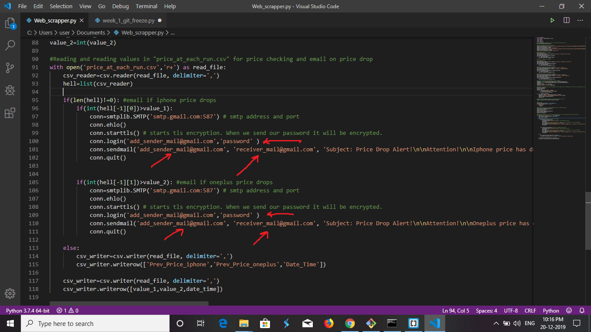

## Problem 1- Ankit's Phone

The application compares the price of two phones namely iPhone 11 and OnePlus 7T Pro. It compares the features of the two phones and gives the output in the form of JSON file named as 'Compare.json'. It also checks for the drop in price of any of the two phones and provides the notification by email. You can compare any two mobile phones of you choice by just changing the url in code.

## Getting Started

Clone the project on you local machine. The main file is " Web_scrapper.py " which contains the code. 

## Prerequisites

First you need to install the modules needed for running of the code which are in the requirements.txt file.(just type in this command in your bash/command prompt)

```
pip3 install -r requirements.txt

```
## Usage 

After installing the modules, 
You need to provide the emails of the sender's as well as the receiver's in the " Web_scrapper.py " file in the space provided and also password of sender's email id(picture shows where in the code you need to add info)



Also you have to turn-on permission to less secure accounts in your gmail account(i.e. sender's email,no need to do it in receiver email)
This can be easily done by following the instructions provided in Official Gmail Website(link given below):
https://support.google.com/cloudidentity/answer/6260879?hl=en

Now after doing all these steps,we are ready to run our application.
For running the application you need to run the following command in cmd/bash
```
python3 Web_scrapper.py

```
The output will be provided in a file named "Compare.json".
The application compares the current price of the phone and price of the phone at previous run which is stored in "price_at_each_run.csv" file every minute.  

## Built with
-Python3.7.4

## Author
> Ashutosh Kumar