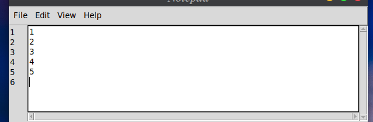
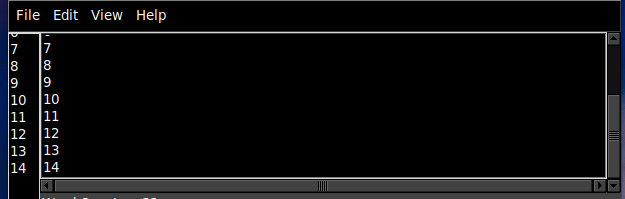
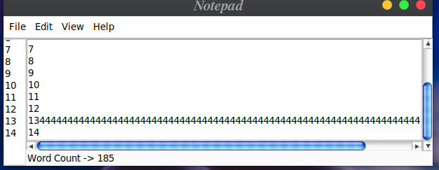
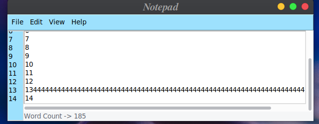
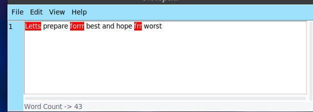
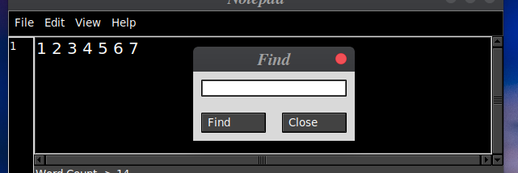

# Tkinter-Text Editor
This is a simple GUI Text Editor made be using tkinter in Python

# Usage
```python
python main.py
```
just run this line in your terminal to get it started

# Features
It Includes Various Features:-

* Basic Commands like New,Open,Save,Save As for Opening Various Files
* Options like Cut,Copy,Paste,Undo,Redo and Select All
* Options like Finding and Replacing Text
* Line Number and Word Count Features
* Changing Font Size, Google Speak and Spell Checker is also Avilable
* Various Attractive Themes(Blacko,Whity and Gyona)

# Screenshots
Basic UI:-  
  

Blacko Theme  
  

Whity Theme  
  

Gyona Theme  
  

Spell Checker at Work  
  

Example Popup Find Window  
  


# Todos
##### All these features are coming soon

* Adding Font Style Change
* Directly Send your file to your Email or Google Drive With Single Click
* On Typing Spell Checker
* Speech to Text Writer
* Increase the number of Themes Avilable
* Improving Find and Relace Options
* Syntax Highlighting For Different Languages
* Changing It to Executable File
