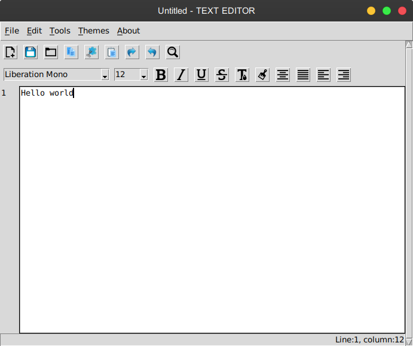
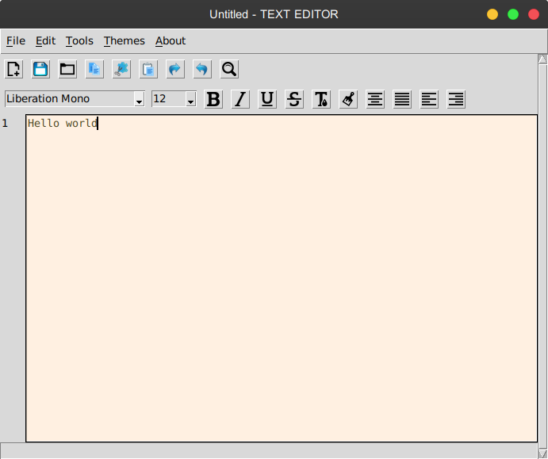
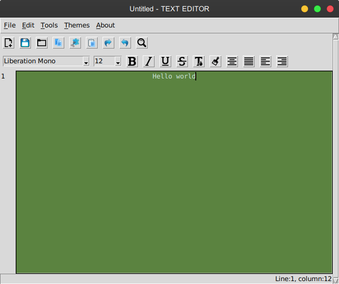

# About :

This a tkinter based text editor written in python.

Works on Python 3.6 and above.
## How to run :

1. Install dependencies -
```
pip install -r requirements.txt
```
2. Run programme - 
```
python main.py
```
## Some features :

* Features like New,Open,Save,Save As for files.
* Cut, Copy, Paste, Undo, Redo and Select All.
* Finding and Replacing .
* Some themes.
* Changing font-size, font-style and font-colour.
* Bold, Italic, Underline etc other functions.

## Screen shots :









## Contributing :

Feel free to contact on alokratn001@gmail.com 
for implementing more exciting features .